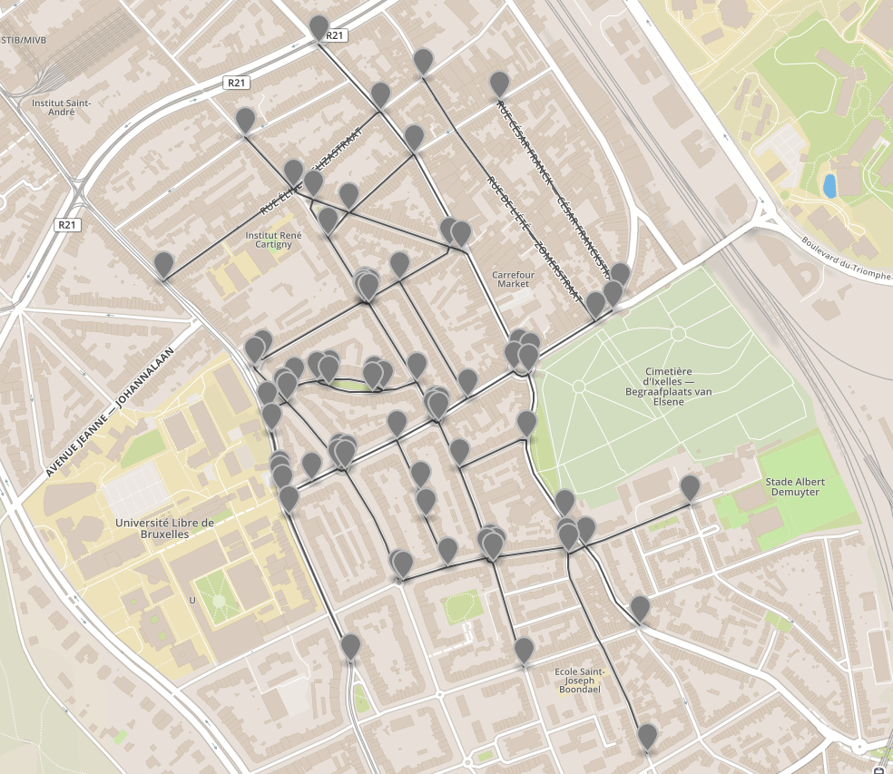
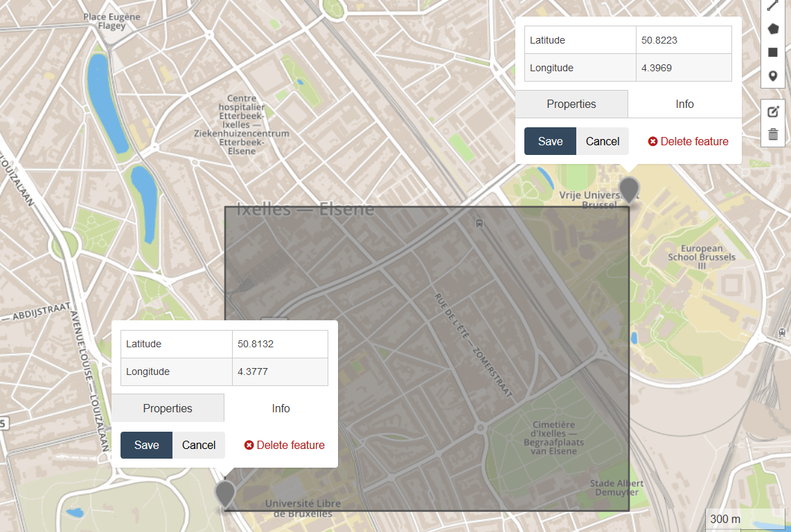
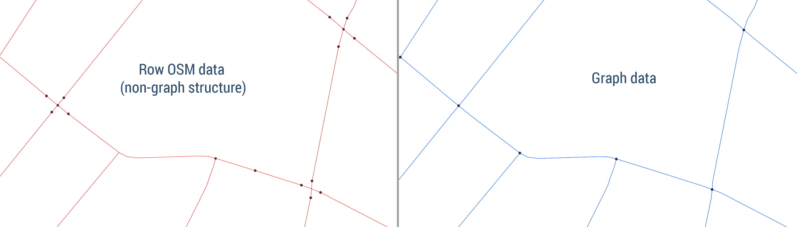

#Graph From OSM

## Introduction

Here is a minimalistic JavaScript module to can dynamically generates a script to perform OSM queries (to https://overpass-api.de/api/interpreter) and download relevant data about the routing-network. Then it transform it to a **Graph-structured** data in **geoJSON** (https://en.wikipedia.org/wiki/GeoJSON) format. It is possible to specify the geographical region and the type of roads to download.

- What is a geoJSON format?
  It is a common JSON based format to represent geographical data with large ecosystem of libraries and softwares able work with it. It can be easily visualized for example on https://geojson.io/ or on softwares such as Q-GIS.

- What is Graph-structured?
  By graph structured I refer to a mathematical (directed) graph structure (https://en.wikipedia.org/wiki/Graph_(discrete_mathematics)), which is basically a set of nodes (also called vertices) connected by links (also called edges). So, in our case each **road is a link** and each **intersection is a node**.

Here is a visualization of the result,

(image generated with https://geojson.io/)

## How to use

1) First you have to install **node.js** and **npm** on your computer.
2) Then initialize the module with the command ``npm install``.
3) To perform a query, execute the command ``npm run generate``.
Congratulation, you have obtained you graph!!
- OSM script in ``./data/script.txt``
- OSM raw data in ``./data/osm-raw-data.json``
- graph in ``./data/graph.json``

Or you can use the following function (exposed in ``index.js``) in you own code:
- ``generateOsmScript``:    Generates an OSM script from settings    (1)
  settings => OSM script
- ``runOsmQuery``:          Make an OSM query from an OSM script     (2)
  OSM script => OSM row Data
- ``osmDataToGraph``:       Transform OSM data into geojson graph    (3)
  OSM raw Data => Graph

To see and example of how to use these function in you code, you can look at the script ``./generate.js``.

### Make your own query

By modifying the file ``settings.json``, you can specify

1) The **geographical region** to perform the query as a **bbox** (bounding box).
The bbox is an array of length 4 with float values: **[longitude_1, latitude_1, longitude_2, latitude_2]** where [longitude_1, latitude_1] is the **bottom-left corner** of the box and [longitude_2, latitude_2] is the **top-right corner** of the box. The 4 values should be valid geographical coordinates in degrees (https://en.wikipedia.org/wiki/Geographic_coordinate_system).

For example, the following bbox is defined by the array ``[4.3777, 50.8132, 4.3969, 50.8223]``.

(image generated with https://geojson.io/)


2) The **type of roads** to download. OSM data is based on a system of tags. So each data element possess a set of tags which is a system of key-values pairs. The tag key used to "identify any kind of road, street or path" is ``highway``(https://wiki.openstreetmap.org/wiki/Key:highway). So, by defining the value of the highway tag you can choose the type of roads you need in your data. For example you can consider only high speed highways for car with that tag ``highway: motorway``. Refer to the previous web link to determine what king or highway tag you need.

Here is an example of query (or you can just see the template in ``./settings.json``)

````
{
  bbox: [ 4.3772, 50.8106, 4.3945, 50.8200 ],
  highways: [ "primary", "secondary", "tertiary" ]
}
````
## Remarks

#### 1) OSM raw data do not have initially a graph structure

In OSM raw data, a node element is not always an intersection of roads. Moreover a link can possess an intersection in its middle, which should not be the case in a graph, and so they sometimes need to be separated in multiple links. This is one thing that this module do.
So, the graph data file possess generally fewer nodes and more links than the OMS raw data file.
Here you can see an illustration of this transformation.


(image generated with Q-GIS)

#### 2) Id system of the graph data

Due to the remark (1), the OSM id of a graph link may not be unique, so a new system of ids is generated for this data (`.id`). The old OSM ids are still saved in `.properties.osmId`.

#### 3) Reconstruct the graph topology

In order to reconstruct the graph structure of the geojson graph data. Each link (LineString-type geojson object) possess properties `.src` and `.tgt` which reference the id of a node in ``.id``, this information define the topology of the graph. Note that in roads networks, a node can be linked to itself (`link.src = link.tgt`) and two nodes can be related by multiples links (`link_1.id != link_2.id` but still `link_1.src = link_2.src` and `link_1.tgt = link_2.tgt`).

#### 4) Additional information

Note that in graph data, the features keep the initial OSM tags in `.properties.tags` so that you can infer additional information about this feature form OSM data (maximal speed, incline, one ways, ...). Also link (LineStirng) feature store its length in meters in `.properties.length`.


Author: Matsvei Tsishyn (matvei.tsishyn@gmail.com)
